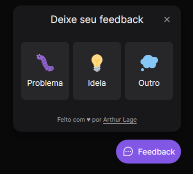
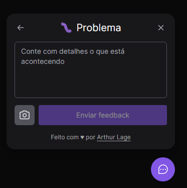
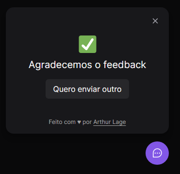

# ✉ About

This website/mobile app, you can send feedbacks to a server, and a chosen email will be notified when new feedbacks are sent

In this project, I was able to learn a lot about ReactJS, React Native, Prisma, TailwindCSS and more.

# 🌆 Images






# ⬇ Run it in your device (WEB)

```bash

git clone https://github.com/arthur-lage/feedback-widget.git

cd feedback-widget

cd web

npm install

npm run dev

# enter your favorite browser and go to http://localhost:3000

```

# ⬇ Run it in your device (SERVER)

```bash

git clone https://github.com/arthur-lage/feedback-widget.git

cd feedback-widget

cd server

npm install

# open the .env file and set the variable DATABASE_URL to your postgresql connection url

npx prisma migrate dev

npm run dev

```

# ⬇ Run it in your device (MOBILE)

```bash

git clone https://github.com/arthur-lage/feedback-widget.git

cd feedback-widget

cd mobile

npm install

npm run start

# open the Expo Go app on your phone, then connect to it using the QR Code

```

# 🎨 Figma Design

If you want to take a look on the design of the website, click the link below:

[Click here to visit the design on Figma](https://www.figma.com/file/o60IqQhYyzwZcQosklnEYQ/Feedback-Widget-(Community)?node-id=100%3A2114)

# ⚛ Technologies Used

These were the technologies used in the project:

### Web

- HTML
- CSS
- JavaScript
- TailwindCSS
- ReactJS
- Typescript

### Server

- NodeJS
- Express
- Typescript
- Postgresql
- Jest
- Prisma

### Mobile

- React Native
- Expo
- Typescript

# 💻 Use the website

If you want to try this project, please click the link below:

[Click here to visit Feedback Widget](https://feedback-widget-al.vercel.app)
